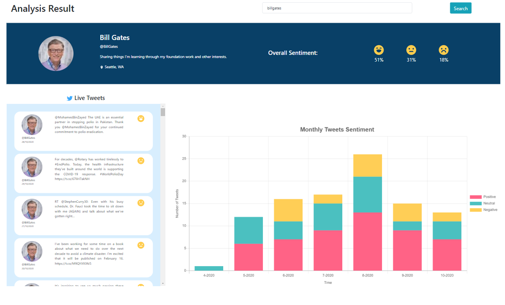
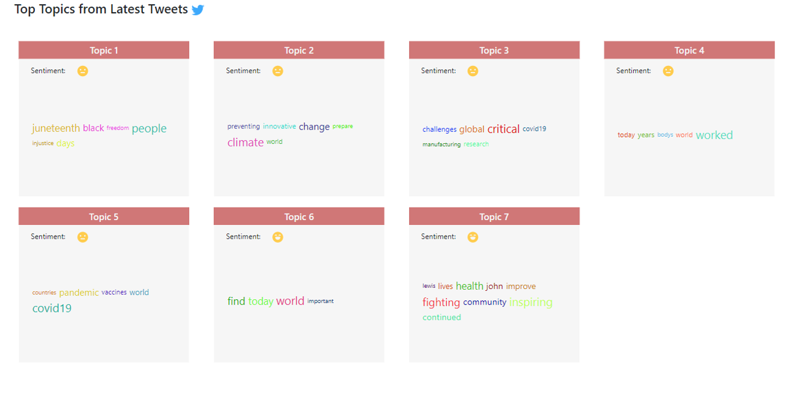

# TwitterFeel
TwitterFeel is a web app which utilise the massive amount of data from Twitter API to analyse and retrieve in-depth information from a Twitter user account. This application will allow people to find out how active a Twitter account post their tweets, what is the sentiment for each tweet, how the sentiment moves changes across the previous months, and what are the common tweet topics from a Twitter account. 

The app will return the Twitter account detail, the account’s past 100 tweets together with its sentiment, a graph of the monthly sentiment analysis, and the popular topics from their past 100 tweets. The application will immediately update this analysis once there is a new tweet posted in the Twitter account.

  
  

## List of Technologies used:
- AWS Storage (S3 bucket and ElastiCache)
- ReactJS
- NodeJS and Express
- AWS EC2 Instance, Load Balancer, and Auto Scaling Group (The app used to be deployed in AWS.)

# How to start:
We expect you to have a S3 bucket and an ElastiCache in AWS or a Redis cache in local computer ready before running this code.
- Place your twitter API, S3 and/or ElastiCache detail in `server/.env` directory.
- If using Redis in local computer, remove line 53 to 56 in fetchTwitter.js file.
- In client directory, run `npm install` and `npm run build`
- In server directory, run `npm install` and `npm start`
- Run `localhost:3000` in your favourite browser.

# Further Information
View the [video](https://youtu.be/HNPcf3XRgxE) of the web app to understand its features.
This app is built in a team - a huge shoutout to my teammate.